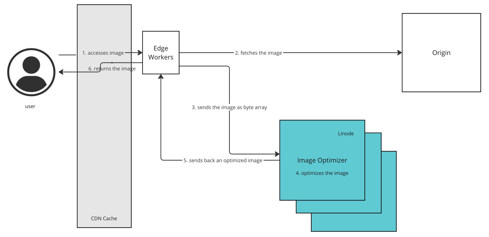

# Image Resizer

The Image Resizer repository consists of two applications. Below describes them.
1. `ImageResizer`: SpringBoot application
   * Takes an image as an input stream and a query parameter indicating whether the client is a mobile device, compresses 
   the image based on the device type, then returns the image as a BufferedImage.
2. `Akamai EdgeWorkers function` stored in the `edgeworkers` folder
   * Takes a user request for an image, gets the image from the origin, passes it to the `ImageResizer`, then returns the
   result to the client

The diagram below depicts the flow:

